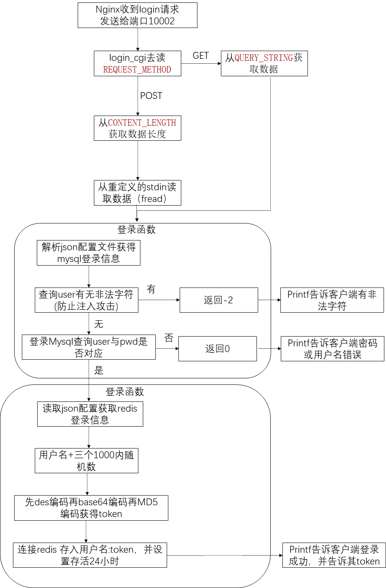
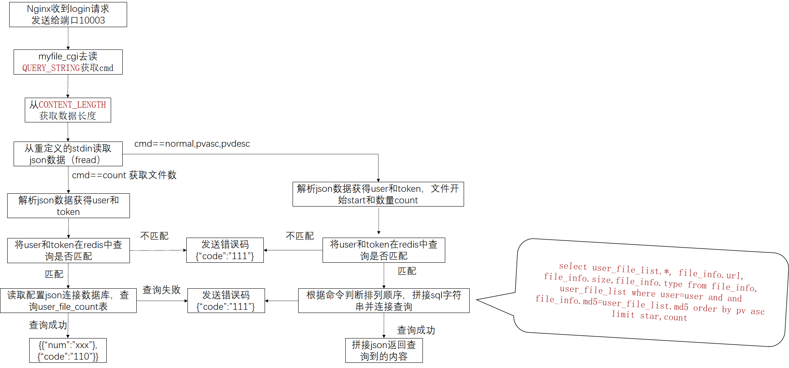
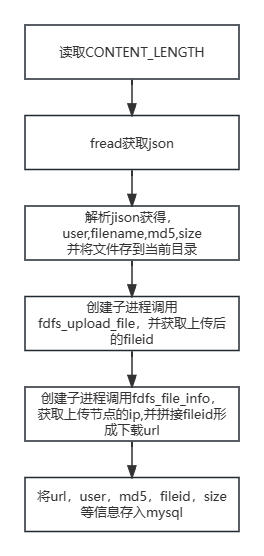

# c++分布式文件存储服务器

作者实现结构：

-16924340601872.png)

## 模块：

- [nginx](.\download\nginx\md笔记\nginx.md)+[fastdfs-niginx插件](.\download\nginx+fastdfs\md笔记\nginx_fastdfs.md)
- mysql
- [fastdfs](.\download\fastdfs\md笔记\fastdfs.md)
- [fastcgi](.\download\fastCGI\md笔记\fastcgi-笔记.md)
- [redis+hiredis](.\download\redis\md笔记\redis.md)

## 目录

- exe QT可执行文件目录
- YYClient QT源码目录
- YYServer 服务器文件
  - download md笔记及安装包
  - include 类头文件
  - common  类实现源文件
  - bin_cgi make后生成可执行文件目录
  - conf 配置文件
  - log日志文件
  - nginx.conf nginx配置文件
  - src_cgi 功能cgi服务源文件
    - reg注册
    - login_cgi 登录cgi程序
    - md5_cgi md5加密
    - upload 上传
    - myfiles 查看个人文件
    - sharefiles 分享
    - dealsharefile 取消分享
    - dealfile 删除文件


## 功能：模拟百度网盘

- 注册+登录
- 上传文件

- 下载文件

- 分享文件

  

- 次要功能

  - JSON数据格式通信

  - md5 base64 des加密

  - token生成与验证

  - log日志

    


## Mysql数据表

1. ### 用户信息表  --  user

   | 字段       | 解释                     |
   | ---------- | ------------------------ |
   | id         | 用户序号，自动递增，主键 |
   | name       | 用户名字                 |
   | nickname   | 用户昵称                 |
   | phone      | 手机号码                 |
   | email      | 邮箱                     |
   | password   | 密码                     |
   | createtime | 时间                     |

   ```mysql
   CREATE TABLE user (
       id BIGINT NOT NULL PRIMARY KEY AUTO_INCREMENT,
       name VARCHAR (128) NOT NULL,
       nickname VARCHAR (128) NOT NULL,
       password VARCHAR (128) NOT NULL,
       phone VARCHAR (15) NOT NULL,
       createtime VARCHAR (128),
       email VARCHAR (100),
       CONSTRAINT uq_nickname UNIQUE (nickname),
       CONSTRAINT uq_name UNIQUE (NAME)
   );
   ```

2. ### 文件信息表  - user_file_list

   | 字段     | 解释                                                         |
   | -------- | :----------------------------------------------------------- |
   | md5      | 文件md5, 识别文件的唯一表示(身份证号)                        |
   | file_id  | 文件id-/group1/M00/00/00/xxx.png                             |
   | url      | 文件url 192.168.1.2:80/group1/M00/00/00/xxx.png - 下载的时候使用 |
   | size     | 文件大小, 以字节为单位                                       |
   | type     | 文件类型： png, zip, mp4……                                   |
   | fileName | 文件名                                                       |
   | count    | 文件引用计数， 默认为1    每增加一个用户拥有此文件，此计数器+1 |

   ```mysql
   CREATE TABLE user_file_list (
       user VARCHAR (128) NOT NULL,
       md5 VARCHAR (200) NOT NULL,
       createtime VARCHAR (128),
       filename VARCHAR (128),
       shared_status INT,
       pv INT
   );
   ```

3. ### 用户文件列表  -  user_file_list 

   | 字段          | 解释                               |
   | ------------- | ---------------------------------- |
   | user          | 文件所属用户                       |
   | md5           | 文件md5                            |
   | createtime    | 文件创建时间                       |
   | filename      | 文件名字                           |
   | shared_status | 共享状态, 0为没有共享， 1为共享    |
   | pv            | 文件下载量，默认值为0，下载一次加1 |

   ```mysql
   CREATE TABLE user_file_list (
       user VARCHAR (128) NOT NULL,
       md5 VARCHAR (200) NOT NULL,
       createtime VARCHAR (128),
       filename VARCHAR (128),
       shared_status INT,
       pv INT
   );
   ```

4. ### 用户文件数量表  -  user_file_count 

   | 字段  | 解释           |
   | ----- | -------------- |
   | user  | 文件所属用户   |
   | count | 拥有文件的数量 |

   ```mysql
   CREATE TABLE user_file_count (
       user VARCHAR (128) NOT NULL PRIMARY KEY,
       count INT
   );
   ```

5. ### 共享文件列表  -  share_file_list 

   | 字段       | 解释                               |
   | ---------- | ---------------------------------- |
   | user       | 文件所属用户                       |
   | md5        | 文件md5                            |
   | createtime | 文件共享时间                       |
   | filename   | 文件名字                           |
   | pv         | 文件下载量，默认值为1，下载一次加1 |

   ```mysql
   CREATE TABLE share_file_list (
       user VARCHAR (128) NOT NULL,
       md5 VARCHAR (200) NOT NULL,
       createtime VARCHAR (128),
       filename VARCHAR (128),
       pv INT
   );
   ```

## CGI程序

### reg注册程序

- 需要把#inlucde “fcgi_stdio.h“放在所有include的最后


### login登录程序

- 修改redis配置文件把bind=127.0.0.1去掉 protect-mode=no开启远程访问

  且启动时需要加上 redis-server 配置文件目录  读入配置文件



### myfiles获取当前用户文件



### md5

- 上传时先在file_list中查找是否有相同的md5编码，若有，则说明云盘中有其他用户上传的相同文件，此时只需要更新当前用户的数据库信息，而不需要真的上传该文件

.png)

### upload上传文件



### dealfile

- cmd==share 分享文件
- cmd==pv  下载后mysql pv字段加一
- cmd==del删除文件

-16924322136861.png)

.png)

.png)

.png)


### sharefiles获取分享文件目录

.png)


### dealsharefile

- cmd==cancel 取消分享

- cmd==pv 分享文件下载字段处理

- save 转存分享文件

  .png)